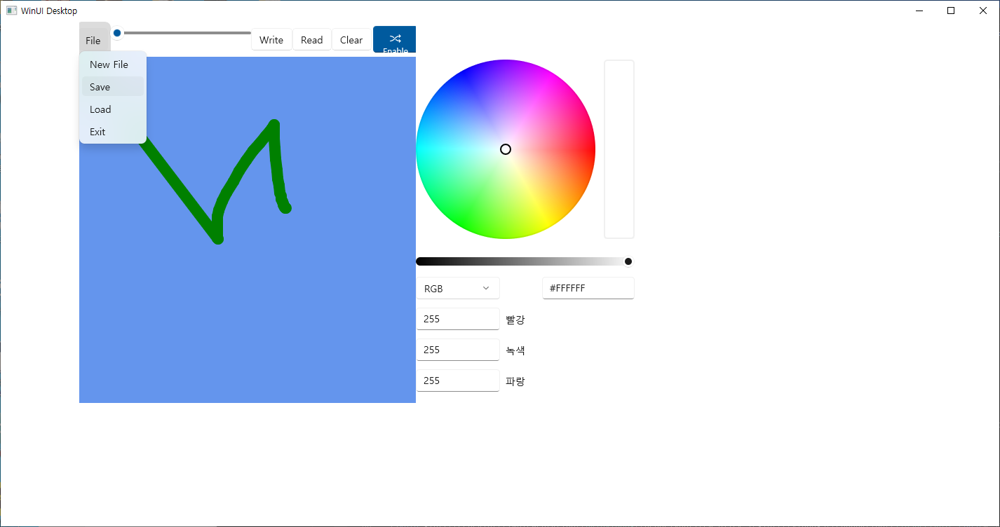
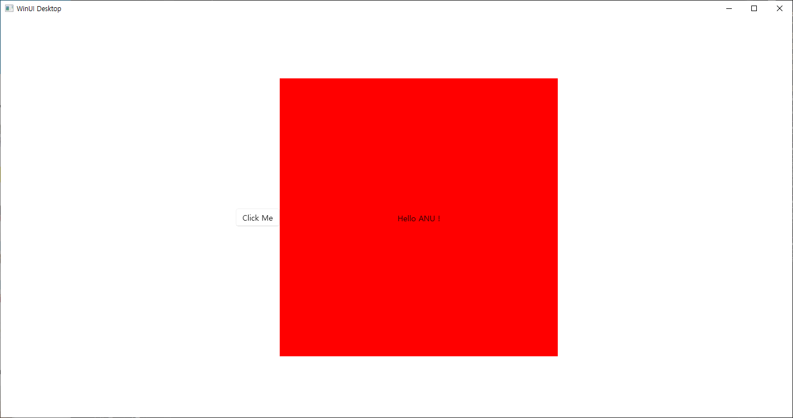
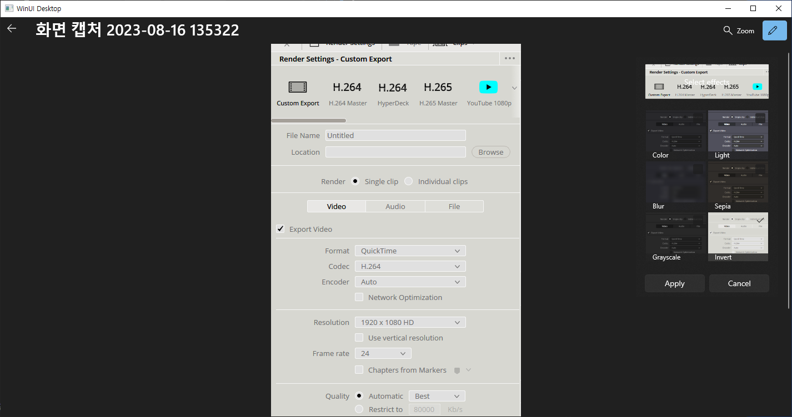

# 231212 비주얼프로그래밍 실습코딩

20191276 컴퓨터공학과 양용석

1. 펜의 굵기 및 색상 선택이 가능하며 저장과 읽기가 가능한 펜 구현
2. 500x500 크기의 XAML controls를 만들기
3. WINUI 3 을 이용한 간단한 사진 뷰어 만들기 
4. 영상에 Effect를 가할 수 있도록 에디터 만들기

실행 화면 

1. 펜 구현 (PenPaint)
 

2. 버튼 구현 (BgLabelControlApp)
 

사진 뷰어 구현 (SimplePhotos)
 

사진 에디터 구현 (PhotoEditor-master)
 

모두 실행 되었습니다.  
simplephotos 는 배포, 정리, 빌드 후 프로젝트를 껐다 다시 켜니 실행됩니다. 
